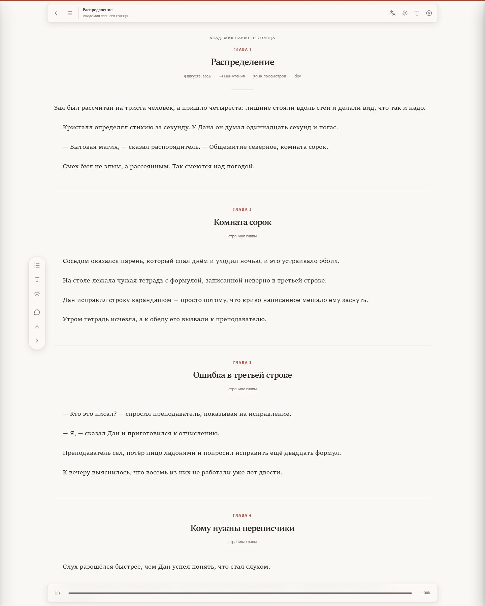
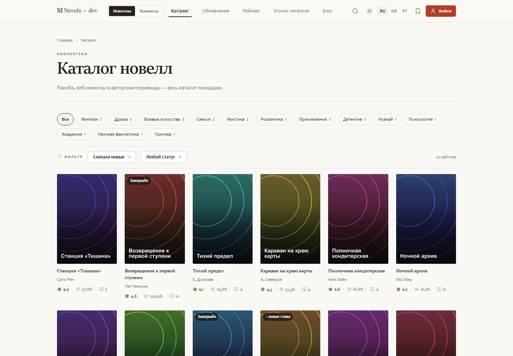
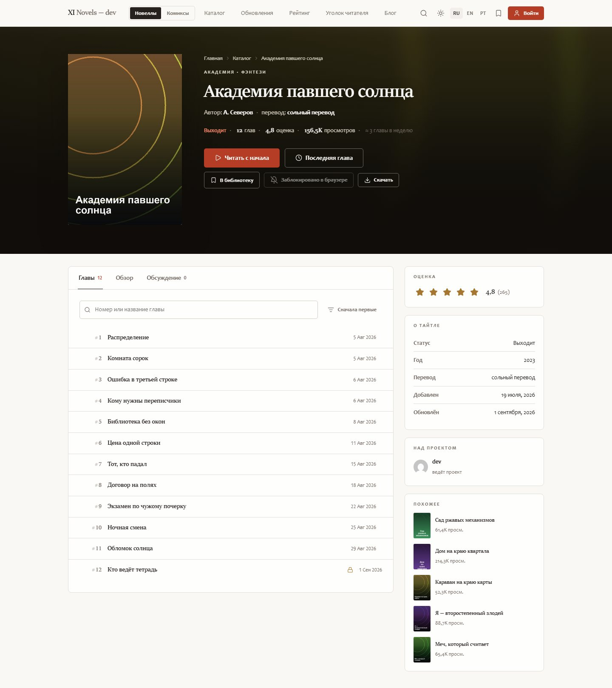
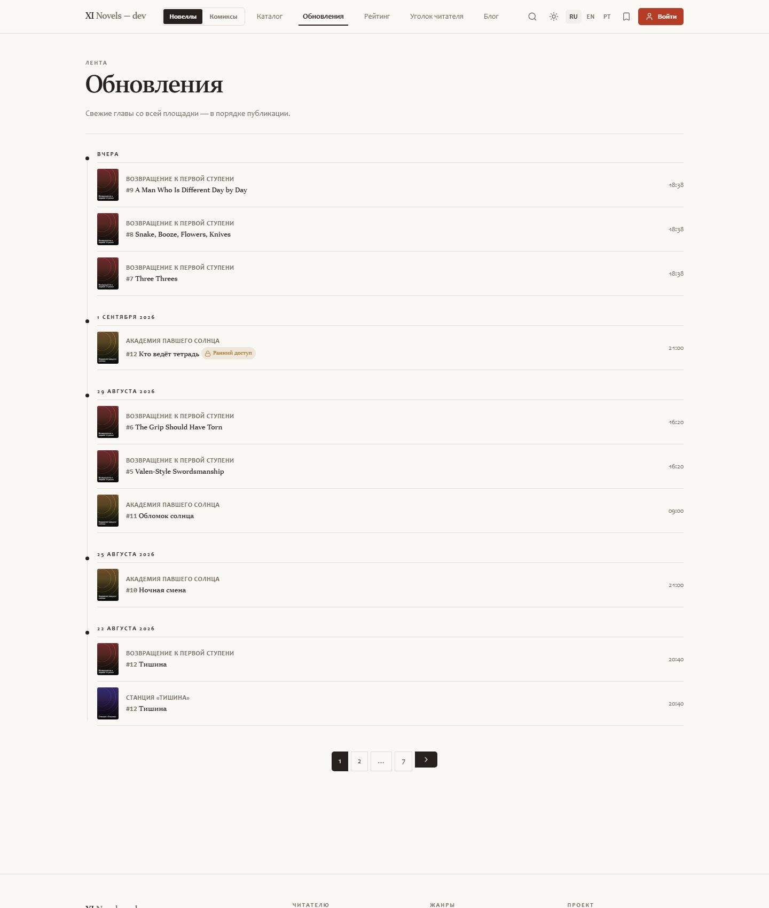
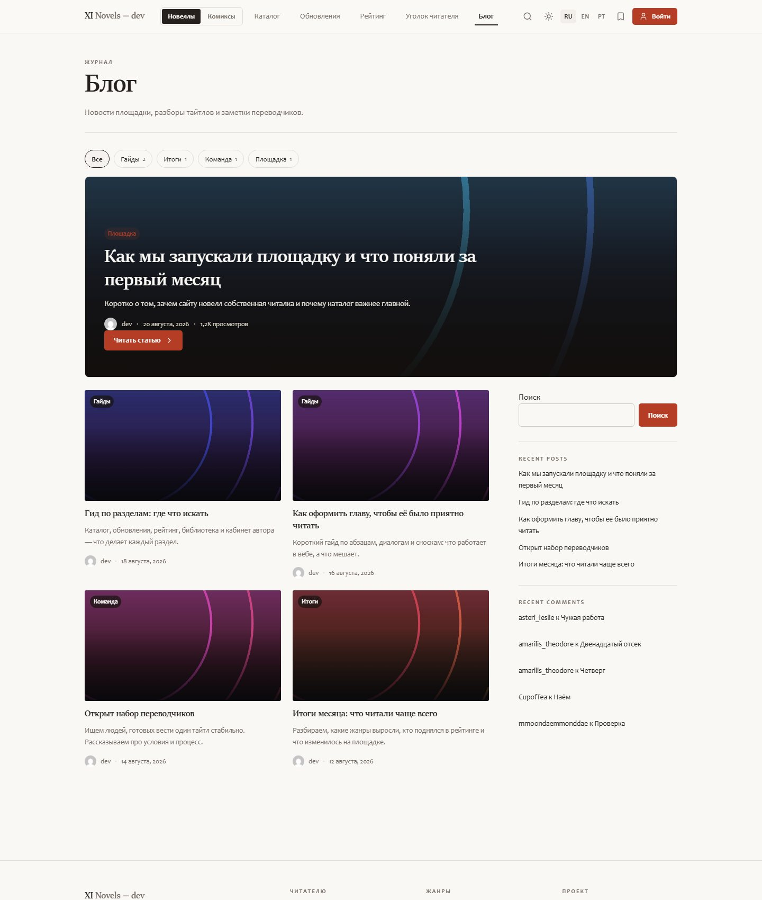
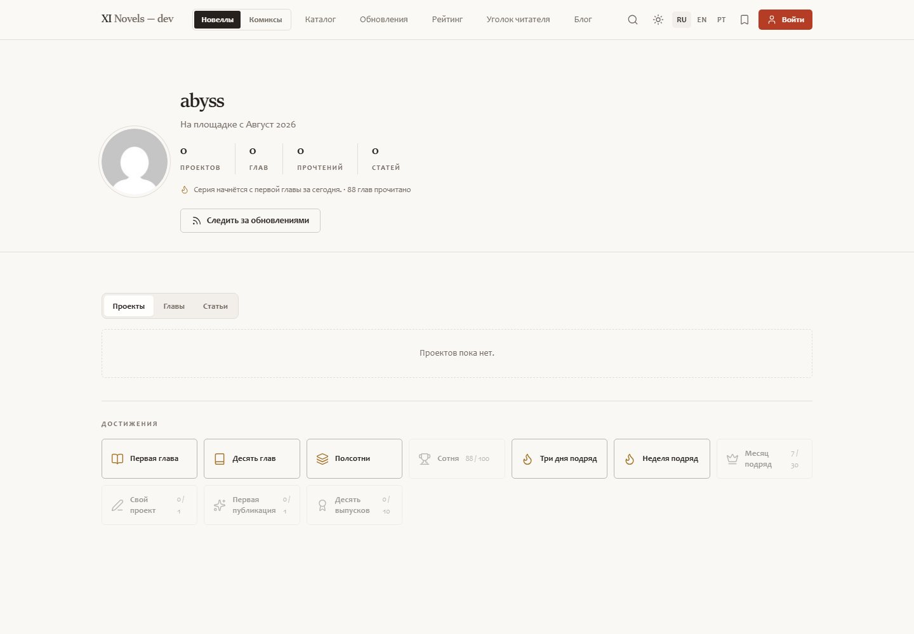
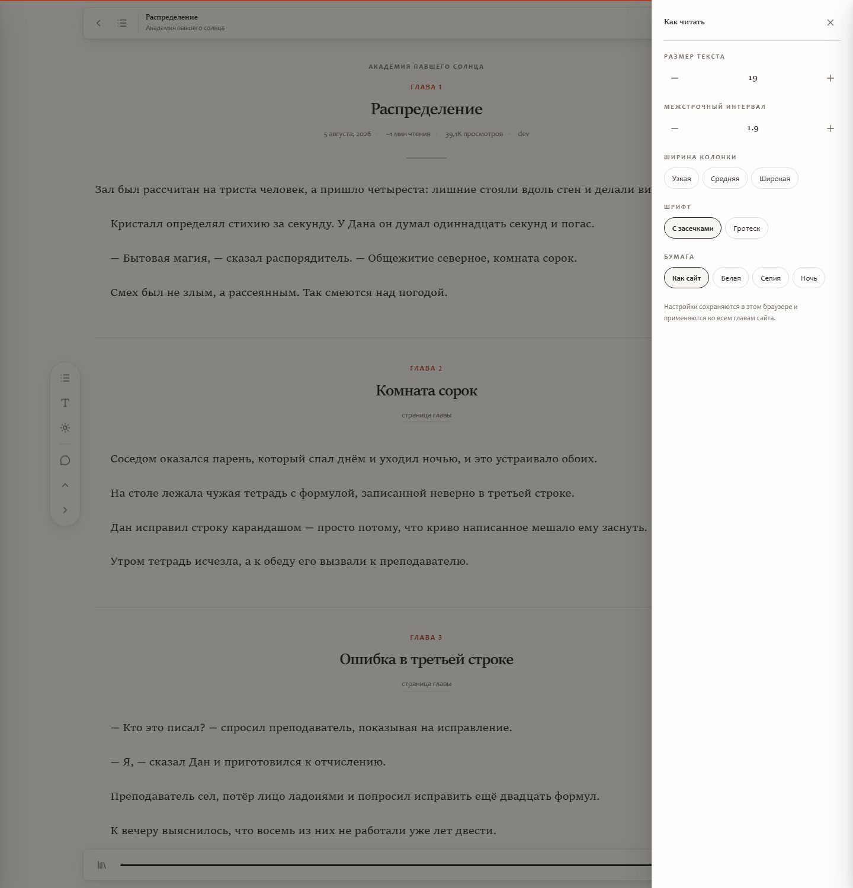
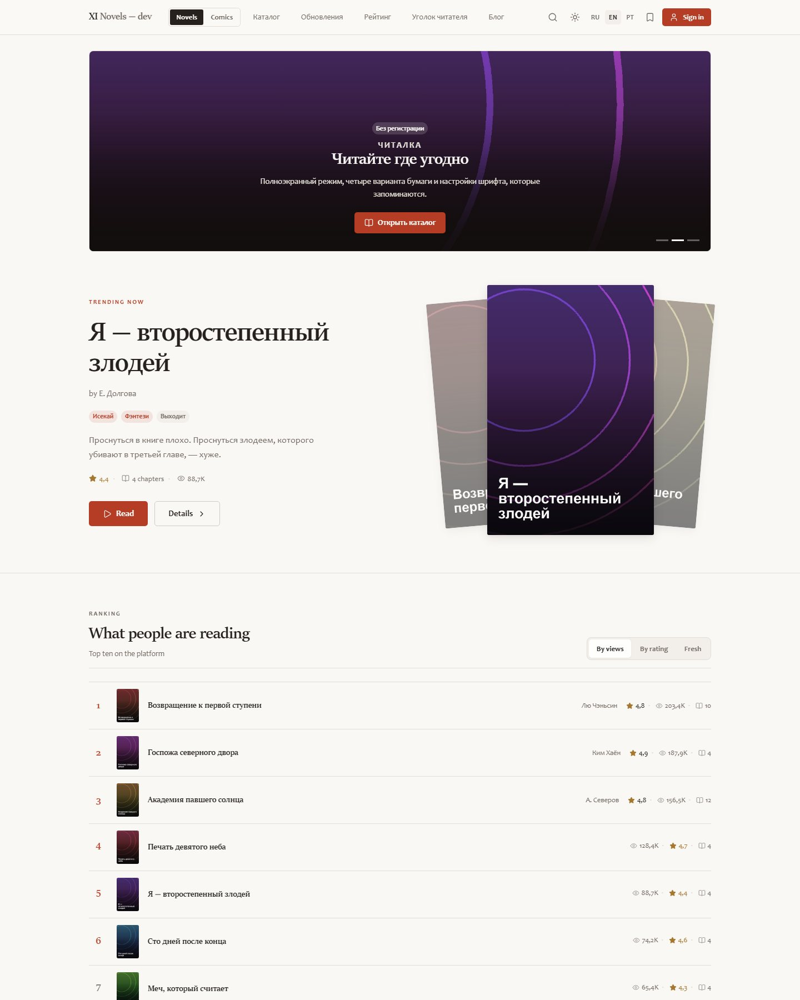
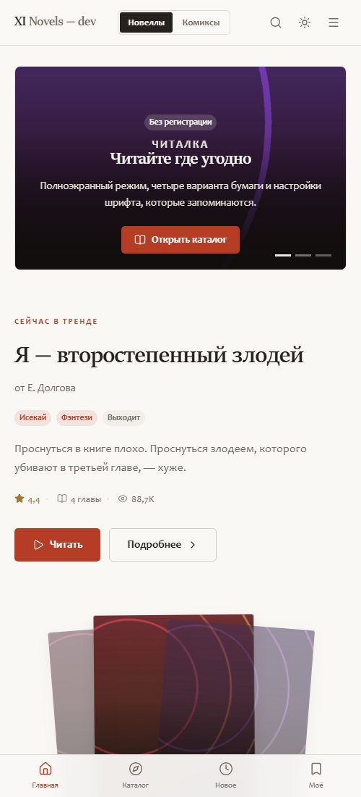

<div align="center">

# WordPress Novel Themes

### Stop running a blog. Run a novel platform.

**A free, GPL, zero-dependency WordPress theme that turns a plain install into a full light-novel / web-novel / ranobe site — catalog, chapters, distraction-free reader, rankings, author studio, reader library.**
**And it never looks like WordPress.**

[](CHANGELOG.md)
[](LICENSE)
[](https://wordpress.org/)
[](https://www.php.net/)
[](https://getbootstrap.com/)
[](#tech-stack)
[](#tech-stack)
[](#languages)
[](#contributing)

**[🌐 Live demo — xi.community](https://xi.community)**

[Русская версия →](README.ru.md) · [Install](#install-in-two-minutes) · [Docs](docs/) · [Screenshots](#screenshots) · [FAQ](#faq)

</div>


---

> ### 🚧 Status: **beta 0.0.4**
>
> The platform works end to end — you can install it today and publish titles and chapters. What is not final is the **presentation layer**. Bootstrap 5 is the current base, not the destination: the plan is to benchmark alternatives and keep whichever wins on real numbers.
>
> **What gets measured before a framework stays:** payload after gzip, render-blocking bytes, Largest Contentful Paint on a mid-range phone, layout shift on the catalog grid, and how the reader feels during a 40-minute session — line rhythm, contrast at night, how quickly settings apply.
>
> **Candidates on the bench:** Bootstrap 5 (now) · Tailwind with a build-free CDN-less subset · UnoCSS · Bulma · Pico.css · plain CSS with only the theme's own tokens and no framework at all.
>
> Expect the markup of shared components (navbar, offcanvas, modal, forms, tabs) to change between betas. The data model, template hierarchy and hooks are already stable — themes built on top of them will survive the swap.
>
> Benchmarks and the decision will land in [CHANGELOG.md](CHANGELOG.md). Opinions and measurements from your own installs are welcome in issues.

> ### 🌐 Live demo: [xi.community](https://xi.community)
>
> A real site running this theme — browse the catalog, open a title, try the reader and its settings.
>
> **Heads-up:** that demo runs on the WordPress build until the team's own platform on **Elixir** ships. Once the Elixir platform launches, xi.community moves over to it and this theme stays here as the WordPress implementation — free, GPL and maintained on its own track.

## ⭐ Why you are reading this

Novel sites are their own genre of website. A title has chapters, chapters have order, readers return for the next one, authors publish several times a week, and everyone reads at night on a phone. WordPress out of the box gives you posts and categories — which fits exactly none of that.

Every other answer is either a **$59–$99 ThemeForest theme** welded to a page builder, or a **SaaS that owns your readers**. This repository is the third option: the entire platform as one theme you can read, fork, rename and ship — for free, forever.

> No page builder. No “pro version”. No subscription. No npm. No CDN. No phone-home.

## What you get

### For readers

| | |
|---|---|
| 📚 **Catalog** | Covers, genres, tags, release status, sorting by views / rating / freshness, filters that survive pagination |
| 📖 **Full-screen reader** | No site header, no footer, no sidebar. Auto-hiding top bar, contents drawer, progress dock, `←` / `→` paging |
| 🎨 **Reading settings** | Font size, line height, column width, serif / sans, four paper themes (site / white / sepia / night) — saved per browser, applied to every chapter |
| 🔖 **Library without an account** | Bookmarks, reading history and “continue reading” live in `localStorage` |
| 🕒 **Updates feed** | Every fresh chapter on the site, grouped into a Today / Yesterday / date timeline |
| 🏆 **Rankings** | Podium for the top three plus a list to tenth place, three competing orders in one block |
| 🌙 **Dark & light** | Dark by default, toggle in the header, no white flash on load |
| 🌍 **RU / EN interface** | Language switch in the header, remembered in a cookie |

### For authors

| | |
|---|---|
| ✍️ **Author studio on the front end** | Create projects and chapters without ever opening `/wp-admin` |
| 🧰 **The real editor** | WordPress TinyMCE with media upload, plus a code tab for pasted HTML |
| 💾 **Drafts that survive** | Chapter text auto-saves to the browser while you write; live word count |
| 🔢 **Chapter numbering** | Next number pre-filled; fractional numbers (`12.5`) for side stories |
| 👑 **Early access** | Mark chapters as PLUS — locked for guests, badged in the contents |
| 🧑‍🎤 **Public profiles** | Author page with stats and tabs: projects / chapters / articles |

### For the owner

| | |
|---|---|
| 🕵️ **Nothing screams WordPress** | Admin bar off; generator, RSD, wlwmanifest, shortlink, oEmbed, emoji, X-Pingback and asset version strings stripped; REST moved from `/wp-json/` to `/api/`; login page restyled in your brand |
| 🎛️ **Customizer** | Accent and premium colors, default color scheme, twelve home blocks you can switch off one by one, footer text, social links |
| 🧩 **Own widgets** | “Novel picks” (views / rating / new / updated) and “Latest chapters” |
| 🚫 **No comments anywhere** | Shipped deliberately without discussions — front end, templates and admin section all clean |
| 🌐 **Translation ready** | 557 strings, Russian source + compiled English `.mo`, plus a build script |



## How it compares

| | This repo | Paid marketplace themes | Novel SaaS platforms |
|---|---|---|---|
| Price | **Free, GPL** | $59–$99 + renewals | Revenue share / monthly |
| Source you can read | **Yes, ~7k lines, commented API** | Obfuscated builder JSON | None |
| Page builder required | **No** | Usually yes | n/a |
| npm / composer / build | **None** | Often | n/a |
| External runtime calls | **Zero** | CDN fonts, trackers | Everything |
| Front-end author studio | **Yes** | Rare | Yes |
| Full-screen reader with settings | **Yes** | Rare | Yes |
| You own the readers and data | **Yes** | Yes | **No** |
| Looks like WordPress | **No** | Yes | n/a |

## Tech stack

Deliberately boring and dependency-light — you can read the whole thing in an evening.

| Layer | What is used | Why |
|---|---|---|
| CMS | **WordPress 6.4+** (tested to 7.0), classic theme, no FSE | The site editor cannot express a reader, a studio or a ranking without ten plugins |
| PHP | **7.4+**, plain procedural WordPress API | No composer, no autoloader, no framework — drops into any host |
| CSS framework | **Bootstrap 5.3.3**, bundled locally in `assets/vendor/` | Grid, navbar, offcanvas, modal, dropdown, tabs, forms, pagination — accessible and battle-tested |
| Design layer | **Custom CSS with HSL design tokens** (`style.css`, `skin.css`, `pages.css`, `parts.css`) | Bootstrap is re-skinned through CSS variables; the light and dark ladders are built from measured contrast |
| JS | **Vanilla ES5**, ~700 lines + Bootstrap bundle | No build step, no npm, no framework |
| Data model | Two post types (`novel`, `chapter`), three taxonomies (`genre`, `novel_tag`, `novel_status`), post meta | Standard WordPress — your content stays portable |
| Editor | `wp_editor()` / TinyMCE on the front end | Authors get the editor they already know |
| Client storage | `localStorage` for library, history, reading settings, drafts | Readers keep their place without an account |
| REST | One namespaced route (`/api/xin/v1/rate`) | Anonymous rating without a plugin |
| i18n | Gettext `.po` / `.mo` + build script | No translation plugin required |
| Icons | Inline SVG sprite in PHP | No icon font, no external request |
| Fonts | System stack | Nothing loaded from Google |
| Dev sandbox | PHP built-in server + **SQLite** drop-in | Preview without installing MySQL |

## Install in two minutes

```bash
git clone https://github.com/rurumiru/wordpress-novel-themes.git
cp -r wordpress-novel-themes/themes/xi-novels /path/to/wordpress/wp-content/themes/
```

**Appearance → Themes → XI Novels → Activate.** On activation the theme creates the “Author studio” and “My library” pages and seeds release statuses (Ongoing / Completed / On hiatus / Announced). Set permalinks to *Post name* and add your first title under **Novels → Add new**.

### Try it without a database

No MySQL? The repo ships a sandbox recipe: PHP’s built-in server plus the official SQLite drop-in, seeded with demo titles and chapters.

```bash
php -S localhost:8080 -t wordpress tools/dev-router.php
```

Step by step: **[docs/install.md](docs/install.md)** ([RU](docs/install.ru.md)).

## Repository layout

```
themes/xi-novels/      the theme — everything above lives here
  inc/                 post types, meta boxes, template tags, customizer,
                       widgets, author studio, i18n, nav walkers, cleanup
  template-parts/      home sections, catalog, studio screens
  assets/              css (4 files), js (2 files), vendor/bootstrap
  languages/           en_US.po / en_US.mo
plugins/               which plugins the project uses and why
tools/                 dev-server router, bulk importer, translation builder
docs/                  install, authoring, import, customizing, development
screenshots/           what it looks like
```

## Documentation

* **[Installation](docs/install.md)** — production install, dev sandbox on SQLite, permalinks, first title ([RU](docs/install.ru.md))
* **[Authoring](docs/authoring.md)** — the studio, chapter numbering, early access ([RU](docs/authoring.ru.md))
* **[Import & heavy uploads](docs/import.md)** — the bundled importer, JSON/CSV manifests, WP All Import and WP-CLI recipes, and every PHP / nginx / LiteSpeed / Cloudflare limit you must raise before large covers will upload ([RU](docs/import.ru.md))
* **[Customizing](docs/customizing.md)** — design tokens, customizer options, child theme, hooks
* **[Development](docs/development.md)** — file map, data model, template hierarchy, translations, coding style

## Screenshots

| | |
|---|---|
|  |  |
| Catalog: genre chips, filters, 6-up grid | Title page: synopsis, contents, rating, similar titles |
|  |  |
| Update feed grouped by day | Blog with a lead story and category pills |
|  |  |
| Author profile with tabs and stats | Reader settings: size, leading, width, paper |
|  |  |
| The same site in English | Mobile layout with bottom navigation |

## Languages

The interface ships in **Russian** (source strings) and **English** (`languages/en_US.mo`, 557 strings). A visitor switches with the RU / EN control in the header; the choice is remembered in a cookie.

Adding a third language is one file:

```bash
cp themes/xi-novels/languages/en_US.po themes/xi-novels/languages/de_DE.po
# translate, then
php tools/build-translations.php
```

## Roadmap

Ideas that fit the “no dependencies” rule. Vote with 👍 in issues, or send a PR.

- [ ] **Framework bake-off** — Bootstrap vs Tailwind subset vs UnoCSS vs Bulma vs Pico vs no framework, judged on gzip size, LCP on a mid-range phone, layout shift and reading comfort
- [ ] **Zero-CSS-framework build** as the likely endgame: the theme already carries its own token system, so a framework may end up being dead weight
- [ ] Reader typography pass: measured line length, optical margins, per-language line rhythm
- [ ] EPUB / FBReader export for a whole title
- [ ] Reading streaks and simple achievements
- [ ] Translator teams (several authors per project)
- [ ] Optional paid chapters via WooCommerce bridge
- [ ] Bulk chapter import from `.docx` / `.txt` / Google Docs
- [ ] Optional discussions module (opt-in, off by default)
- [ ] Additional locales: DE, ES, PT-BR, ID, VI

## FAQ

**Will it work on shared hosting?**
Yes. It is a classic theme: PHP files, CSS, JS. No composer, no node, no cron.

**Do I need any plugins?**
No. Caching and anti-spam are optional — see [plugins/](plugins/README.md).

**Can I sell a site built on it?**
Yes. GPL. Rename it, rebrand it, charge for it — no attribution required.

**Can I use the design without WordPress?**
The CSS and JS are additionally offered under MIT, so yes.

**Does it work with the block editor?**
Chapters and titles use the classic editor by design (authors write long text). Pages and blog posts work with blocks normally.

**How many chapters can it handle?**
Chapter lists are cached and sorted by numeric meta; sites with thousands of chapters per title are the design target.

**Is there a demo?**
Clone it and run the sandbox — it seeds a demo catalog in one command. Screenshots above come from that sandbox.

## Contributing

Issues and pull requests are welcome. Two rules: **no build step** (the theme stays editable with a text editor) and **no external runtime dependencies**.

## License

**GPL-2.0-or-later** for the theme as a whole — the only correct license for a WordPress derivative work.

The parts that are not WordPress-derived — CSS in `assets/css/` and JavaScript in `assets/js/` — are additionally offered under **MIT**, so the design system can travel to non-WordPress projects. Bootstrap 5.3.3 is bundled under its own MIT license. Screenshots are illustrative and not part of the licensed code.

---

<div align="center">

**If this saved you a hundred dollars and a weekend — star the repo.** ⭐

*Keywords: wordpress light novel theme · ranobe theme · web novel wordpress · webnovel platform · manga novel site · chapter reader theme · fiction wordpress theme · free novel theme · GPL novel platform · дизайн для ранобэ · тема WordPress для новелл*

</div>
