<div align="center">

<h1>XI&nbsp;Novels</h1>

<h3>Two WordPress themes for a site where people read.</h3>

<p>
A catalog of titles, a title page, a full-screen reader, a reader's library,<br>
an author studio, book downloads, discussions, a project glossary, chapter alerts —<br>
<b>all of it lives in the theme</b>. No required plugins, no external requests, no build step.<br>
<b>And on no screen does it look like WordPress.</b>
</p>

[](https://xi.community)
[](#install)
[](docs/)
[](CHANGELOG.md)

<br>


[](LICENSE)
[](https://wordpress.org/)
[](https://www.php.net/)


[](#languages)

**English** · [Русский](README.ru.md) · [Português&nbsp;(BR)](README.pt-BR.md)

[📢 Channel](https://t.me/licht_re) · [💬 Community chat](https://t.me/xicommunity)

</div>

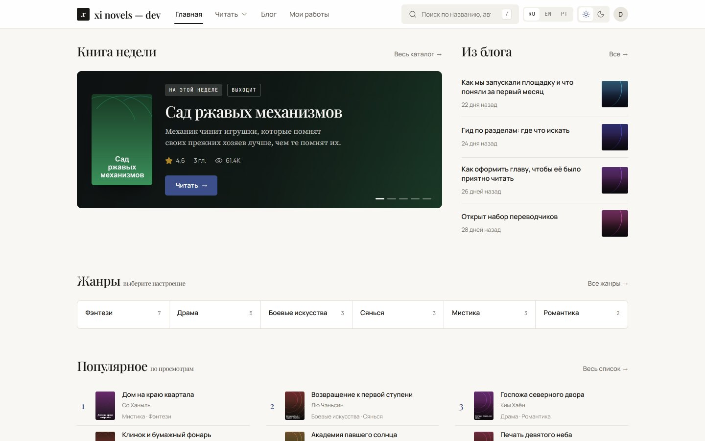

---

## Version 2 — what changed

The repository now ships **two themes**, and they share one database: switching between them is a
click in the admin, with nothing to migrate.

| | |
|:--|:--|
| **XIN-V2** — the new one | Warm paper, a serif for headings, hairlines instead of shadows. A reader with endless scrolling and speech, a reader's library, a community corner, sign-in on the site itself. Written from scratch for large libraries. |
| **XIN-Com** — the classic | The same platform in a denser, magazine-like key. Comics section, banners, management panel, rankings by period. It stays in the repository and keeps getting fixes. |

Two **new plugins** arrived: `XIN Turbo` speeds up any WordPress, and `XIN Setup` brings the site
and the content it already has into the shape the theme expects — from one screen.

The full list is in [CHANGELOG.md](CHANGELOG.md).

---

## Why this one

A loud claim is worth exactly as much as the measurements and the code under it. Here they are.

| | |
|:--|:--|
| 📚 **All of it in the theme, not in five plugins** | Catalog, chapters, reader, rankings, ratings, library, author studio, book export, discussions, project glossary, alerts — one codebase, one data model, one set of settings. |
| 🚀 **It holds large libraries** | Chapter order lives as its own index in the title's meta. The contents of a four-thousand-chapter title cost **6 queries**, the "next chapter" jump costs 6 as well, and a catalog of 24 cards with all their meta and covers costs **9**. Without cache priming those same 24 cards cost 91. |
| 📖 **A reader people come back to** | Endless scrolling: finish a chapter and the next one appends itself, and the address bar changes to it. Size, width, paper, theme; per-paragraph bookmarks and quotes; glossary notes; read-aloud; a progress bar. |
| 🔌 **Zero external requests** | No CDN, no Google Fonts, no trackers. Four typefaces sit in the theme — 22 files, Cyrillic and Latin only. The page loads entirely from your own domain. |
| 🛠 **Zero build** | No npm, no composer, no compile step. Download, unzip into `wp-content/themes`, activate. |
| ✍️ **Authors publish from the site** | Studio, chapter editor, release schedule, early access, co-authors, project glossary — without ever opening `/wp-admin`. |
| 🌍 **Three languages out of the box** | 601 strings in the theme: Russian source, compiled `en_US` and `pt_BR`, an RU / EN / PT switcher in the header. |
| 🔍 **Source you can actually read** | ~13,000 lines of PHP with comments that explain *why it is this way*, not *what the line does*. No obfuscated page-builder JSON. |

> [!TIP]
> **Live demo — [xi.community](https://xi.community).** A real site running this theme: browse the
> catalog, open a title, try the reader and its settings.

---

## XIN-V2

<table>
<tr>
<td width="50%">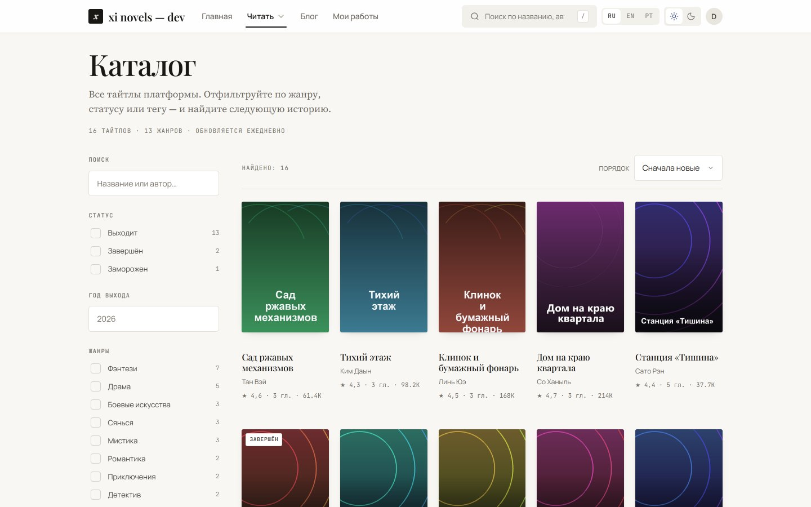</td>
<td width="50%">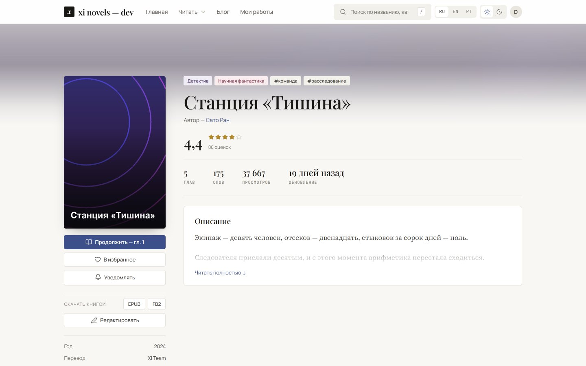</td>
</tr>
<tr>
<td><b>Catalog.</b> Filters by status, year, genre and tag; four sort orders. Every filter change is a plain link, so a selection can be shared and opened from a bookmark.</td>
<td><b>Title page.</b> Contents, rating, length, similar titles, the project team, a book download, and a button for chapter alerts.</td>
</tr>
<tr>
<td>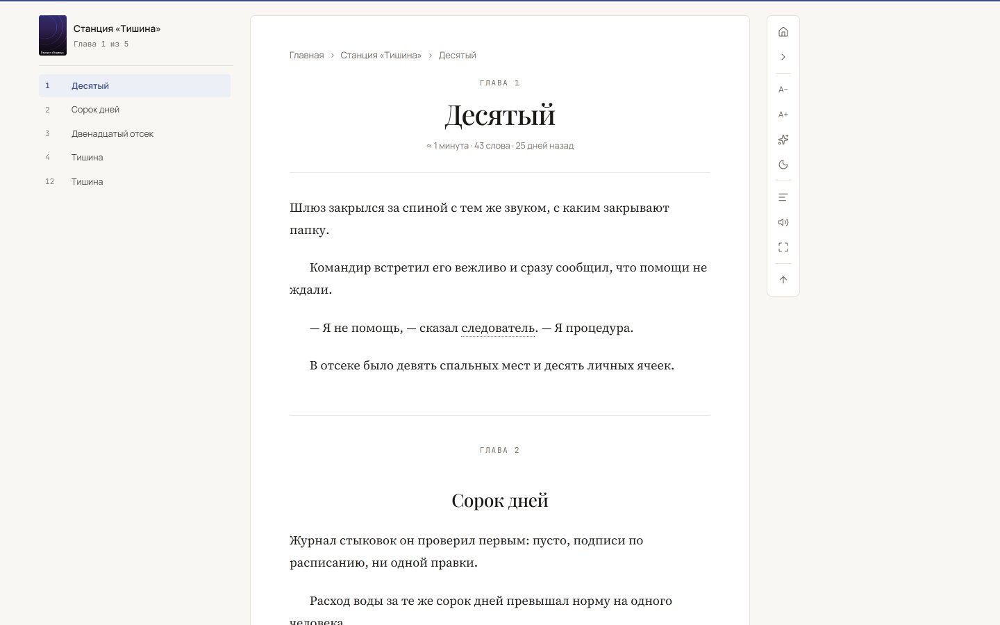</td>
<td>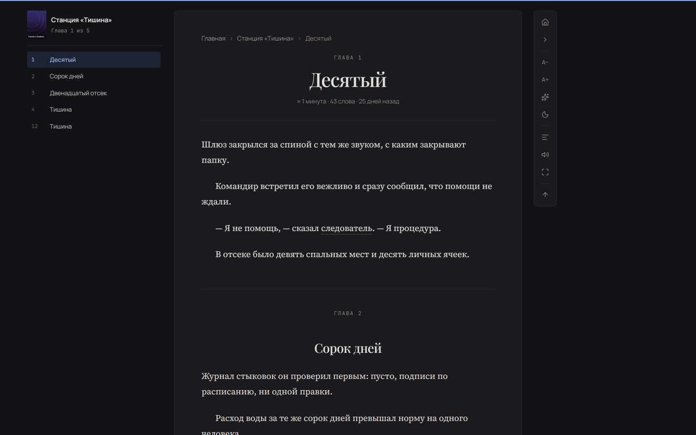</td>
</tr>
<tr>
<td><b>Reader.</b> Contents on the left as a window around the current chapter, a vertical rail on the right, a progress bar on top. The dotted underline is a glossary note.</td>
<td><b>Dark theme.</b> The reader's choice is applied before the first paint — no white flash on load.</td>
</tr>
<tr>
<td>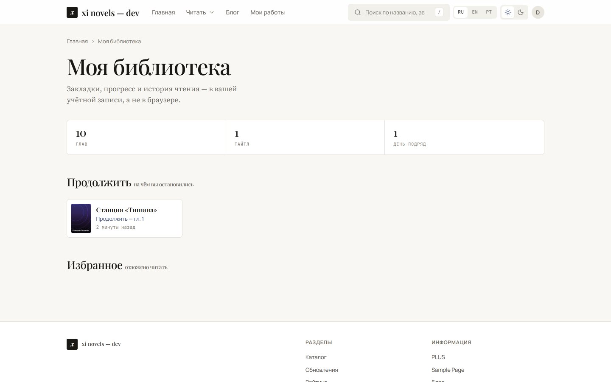</td>
<td>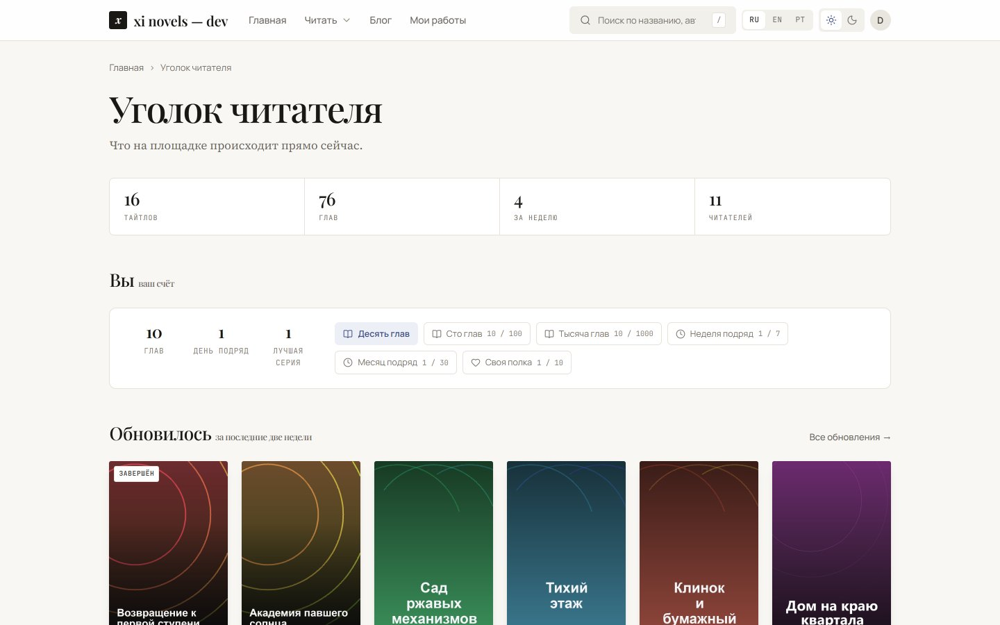</td>
</tr>
<tr>
<td><b>Library.</b> Where the reader stopped, what they saved, what they read recently. All of it in the account rather than the browser: the shelf travels with them to a phone.</td>
<td><b>Reader hub.</b> What was updated, what people are talking about, who reads the most. A signed-in reader also gets their own streak and badges.</td>
</tr>
<tr>
<td>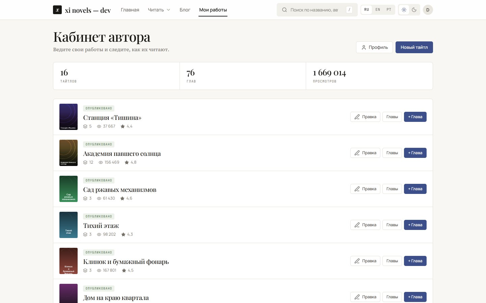</td>
<td>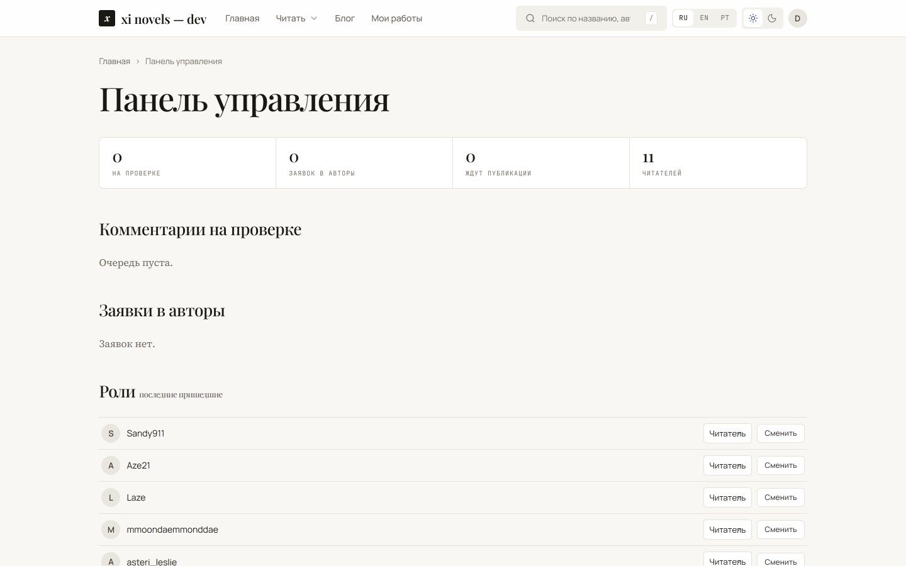</td>
</tr>
<tr>
<td><b>Author studio.</b> Titles, chapters, release schedule, early access, cover, genres, co-authors, project glossary — without opening the admin once.</td>
<td><b>Management panel.</b> The comment queue, author requests and roles — on the site, not in the <code>/wp-admin</code> tables.</td>
</tr>
</table>

<details>
<summary><b>What the reader actually does</b></summary>

<br>

| | |
|:--|:--|
| **Endless scrolling** | The next chapter is appended two screens before the current one ends. The address bar changes to whichever chapter is in front of the reader: the tab closes where they were reading and opens there again. |
| **Reading settings** | Eight font sizes, four column widths, plain and sepia paper, light and dark theme, a mode without the contents rail. All of it lives in the reader's browser and survives the jump to the next chapter. |
| **Bookmarks and quotes** | One click on a paragraph. A bookmark marks the spot with a rule in the margin; a quote copies with a link straight to that paragraph. |
| **Project glossary** | Names, titles and technique names get a dotted underline, and the note appears on hover and on keyboard focus. One term is marked once per paragraph. |
| **Read aloud** | The browser's own speech synthesis, paragraph by paragraph, highlighting what is being read. It starts from the paragraph in view, not from the top of the chapter. |
| **Contents as a window** | On a title with thousands of chapters only a hundred around the current one reach the markup; the rest loads through "above" and "below". |
| **Keys** | Arrows turn chapters, `+` and `−` change the size, `Esc` closes the paragraph buttons. |

</details>

<details>
<summary><b>Early access, payment and the project team</b></summary>

<br>

A locked chapter understands two locks at once:

* **a date** — `_xin_unlock_at`: the chapter opens for everyone at the appointed moment, and until
  then it is visible to the author, to editors and to the project team;
* **a purchase** — `_xin_product`: a WooCommerce product. The key is shared with XIN-Com, so a
  chapter bought there opens here too.

One check covers everything: the chapter page, the contents, endless scrolling and the book export
all answer the same way. A locked chapter reaches neither the EPUB nor the FB2.

The project team is `_xin_team` on the title. A co-author edits the title and its chapters and
reads early access; only the title's owner and editors change who is on it.

</details>

---

## Speed

The numbers below were taken on this repository with a cold object cache. To repeat them: turn on
`SAVEQUERIES` and count queries around the call.

| What | Queries | Time |
|:--|--:|--:|
| Catalog, 24 cards with all meta and covers | **9** | 11.6 ms |
| Contents, a window of 100 chapters | **6** | 6.1 ms |
| "Previous / next" jump | **6** | 3.8 ms |
| A whole title page | 15 | 11.3 ms |
| Home page summary | 10 | 8.4 ms |

The same 24 cards without meta priming cost **91 queries**. The difference is that the theme pulls
the meta, terms and covers for the whole list in one query instead of one query per card.

Chapter order is not rebuilt by a query on every page: it sits as an array of IDs in the title's
meta and rebuilds itself when a chapter appears, changes its number, changes status or goes away.
That is why the contents of a four-thousand-chapter title cost the same as the contents of four.

The view counter does not write a row per visitor: views accumulate in the object cache and land as
one `UPDATE` per batch. The increment happens in the database itself — two visitors in the same
second count as two, not as one.

With the `XIN Turbo` plugin a guest's page is served without starting WordPress at all:

| | No cache | Cached |
|:--|--:|--:|
| Title page | 0.41 s | **0.015 s** |
| Repeat visit with an ETag | — | **304, 0 bytes** |

---

## Plugins

The theme works without them. Each one covers its own job and can be removed on its own.

| Plugin | What for |
|:--|:--|
| **XIN Turbo** | Speed for all of WordPress, not just this theme. A page cache that serves guests without starting the core, a trimmed document head and asset queue, lazy images and embeds, a slowed-down heartbeat, a nightly database sweep. Every switch says what it turns off and what that costs. |
| **XIN Setup** | One screen showing what on the site is set up for the theme and what is not: permalinks, the home page, discussions, cover sizes, genres, section pages, menus. Separately, it fixes the content you already have: chapters with no title attached, chapters with no number, titles with no cover and no excerpt. Every fix shows a number first, applies second, and always works in batches. |
| **XIN-V2 Kit** | Keeps post types, taxonomies and meta outside the theme, so titles and chapters survive a change of look. Plus a Doctor screen: data inconsistencies and their repair. |
| [**XI Studio**](plugins/xi-studio) | The theme's appearance without a line of CSS. |
| [**XI Novel Import**](plugins/xi-novel-import) | Bulk chapter import from files and other sites. |
| [**XI Novel Manager**](plugins/xi-novel-manager) | Bulk editing of titles and chapters. |
| **XI from Fictioneer** | Moving a library over from the Fictioneer theme. |

<table>
<tr>
<td width="50%">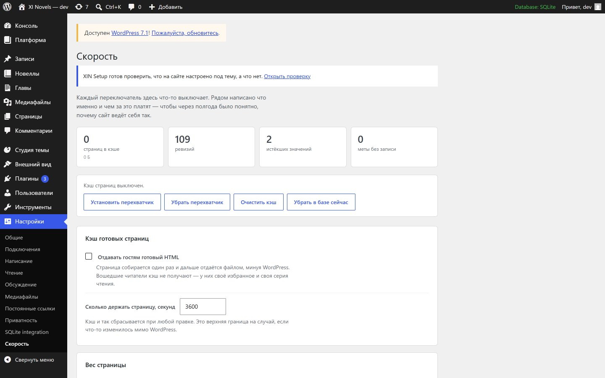</td>
<td width="50%">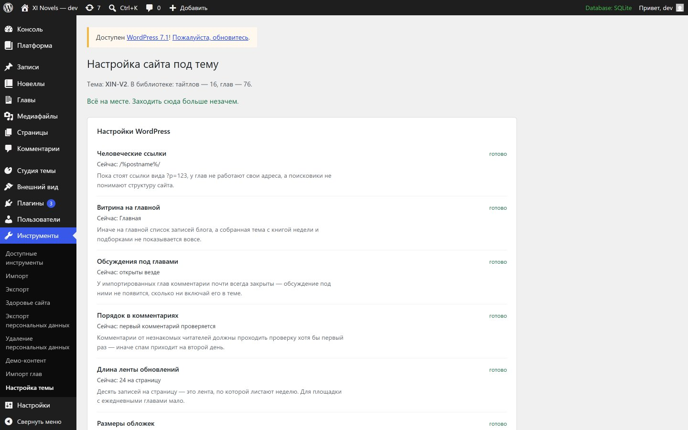</td>
</tr>
<tr>
<td><b>XIN Turbo.</b> No "optimise everything" button: a button like that eventually breaks a site, and the owner has no idea which of thirty settings did it.</td>
<td><b>XIN Setup.</b> A list you read top to bottom. Next to every item: how it is now, what it will become, and why it matters.</td>
</tr>
</table>

---

## Install

**The theme.**

1. Download `xin-v2` from [releases](../../releases) or copy the `themes/xin-v2` folder into
   `wp-content/themes`.
2. Activate it: **Appearance → Themes**.
3. Activate `XIN-V2 Kit` from `plugins/xin-v2-kit` — it keeps the post types outside the theme.
4. Activate `XIN Setup` and open **Tools → Theme setup**. It shows what is missing and creates the
   section pages, the menus and the settings.

That is all. No build, no dependencies.

**Moving from XIN-Com.** Switch the theme — the data stays where it is, because the `_xin_*` model
is shared. XIN-Com names its section pages differently, so after switching open
**Tools → Theme setup**: it creates the missing ones and leaves the existing ones alone.

**Page cache.** It is turned on separately, in **Settings → Speed** → "Install the interceptor".
The plugin writes `wp-content/advanced-cache.php` and sets `WP_CACHE` in `wp-config.php`, and takes
both back out when you turn it off.

---

## Languages

The interface is built in three languages: Russian is the source, `en_US` and `pt_BR` are compiled.
The RU / EN / PT switcher sits in the header; the choice lives in a cookie, so the links people
share stay ordinary.

Rebuild after editing strings:

```
php tools/build-translations.php
```

The builder takes the strings straight from the source, checks them against the maps in
`tools/i18n/`, reports what is missing and what is no longer used, and writes `.po` and `.mo`
without `msgfmt`. A missing string exits non-zero, so it doubles as a check.

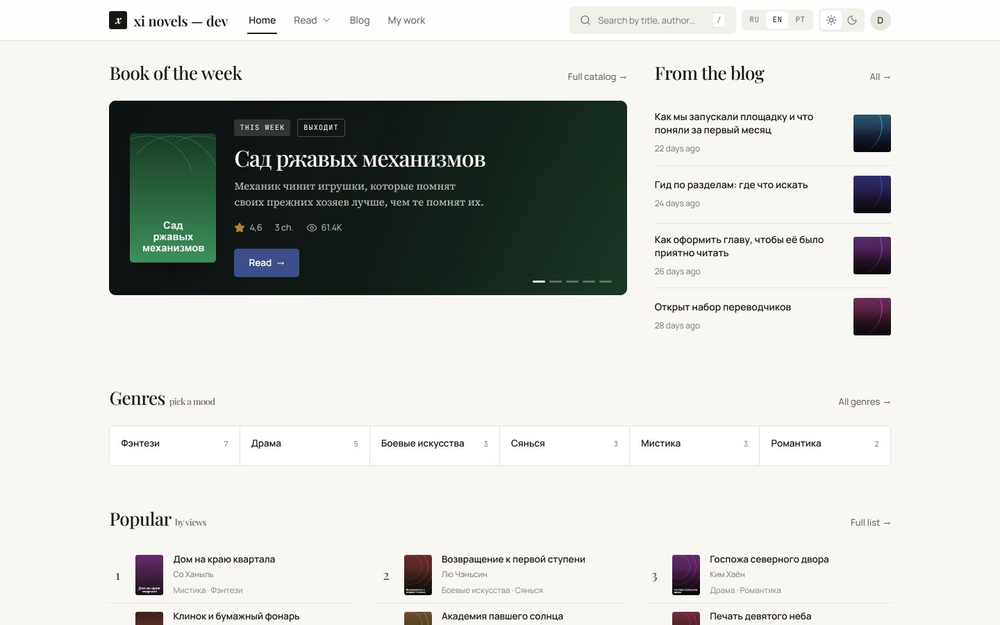

---

## On a phone

<table>
<tr>
<td width="50%">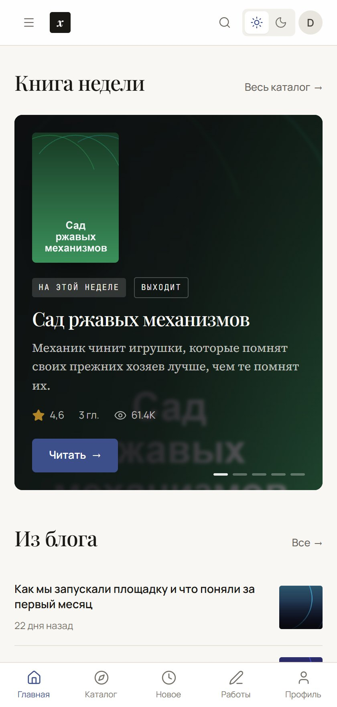</td>
<td width="50%">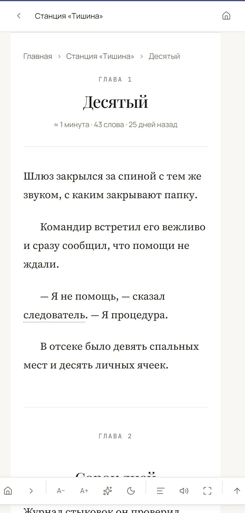</td>
</tr>
</table>

On a narrow screen the reader's rail moves to the bottom, under the thumb, and the contents hide
behind their own screen.

---

## Documentation

| | |
|:--|:--|
| [Install](docs/install.md) | In detail, including moving from other themes |
| [Publishing](docs/authoring.md) | Author studio, schedule, early access, glossary |
| [Import](docs/import.md) | Bulk chapter loading |
| [Customising](docs/customizing.md) | Appearance settings |
| [Development](docs/development.md) | Hooks, filters, structure |

---

## Compatibility

* WordPress 6.4 → 7.x
* PHP 8.0+
* MySQL / MariaDB and SQLite (through `sqlite-database-integration`)
* WooCommerce — only for paid chapters, not required

---

## Contributing

Patches are welcome. Before you send one:

* interface strings go through `__()` with the theme's text domain;
* a comment explains **why** it is done this way, not what the line does;
* after editing strings run `php tools/build-translations.php`, which is also the check;
* a new theme file is required in `functions.php` next to the others.

---

## Licence

[GPL-2.0-or-later](LICENSE). A link back to the repository is not required by the licence, but it
makes the authors happy.
