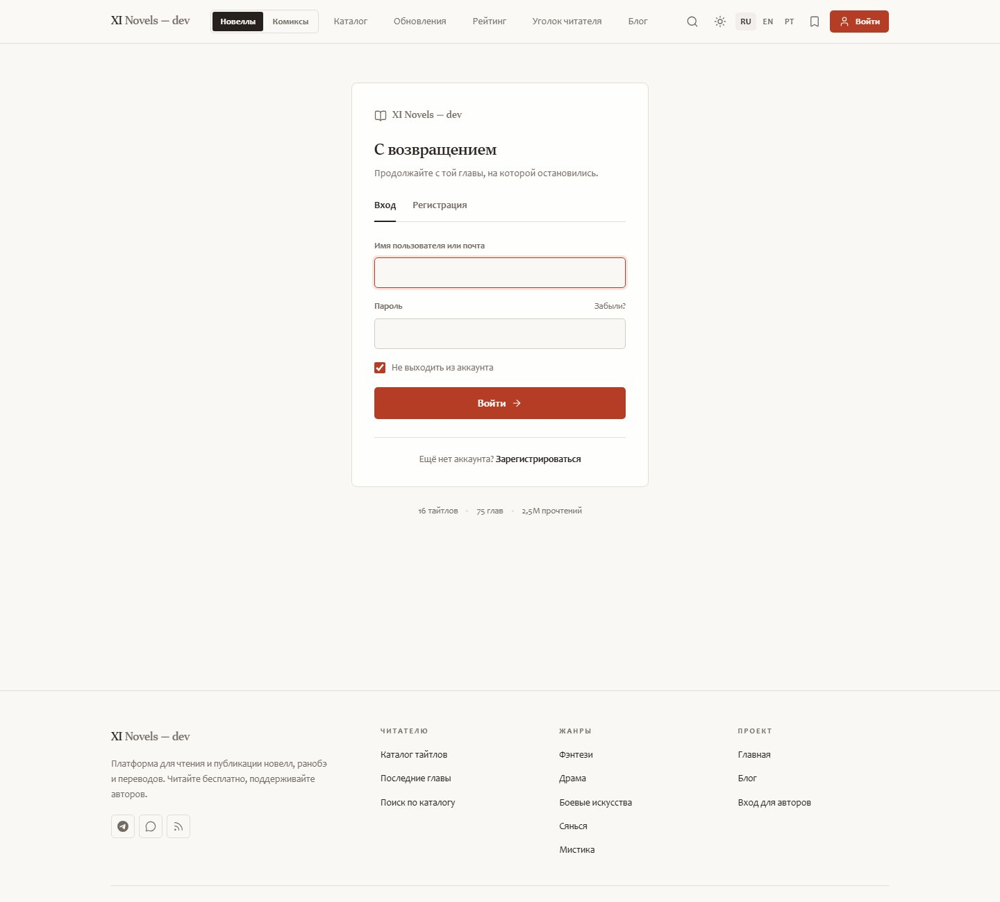
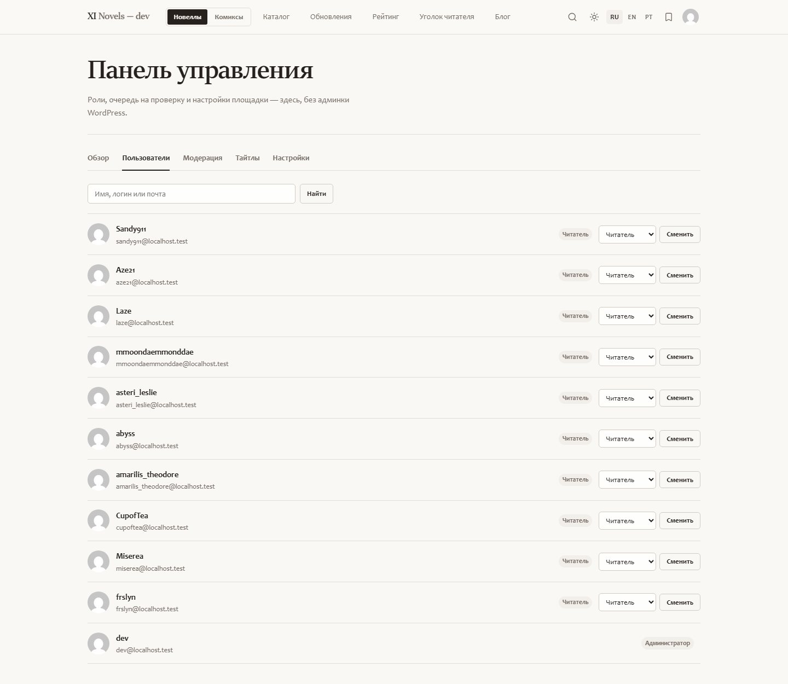
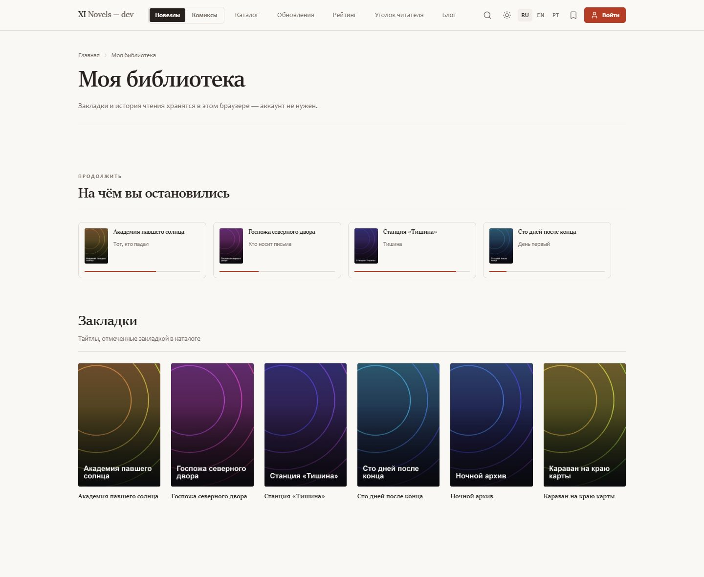
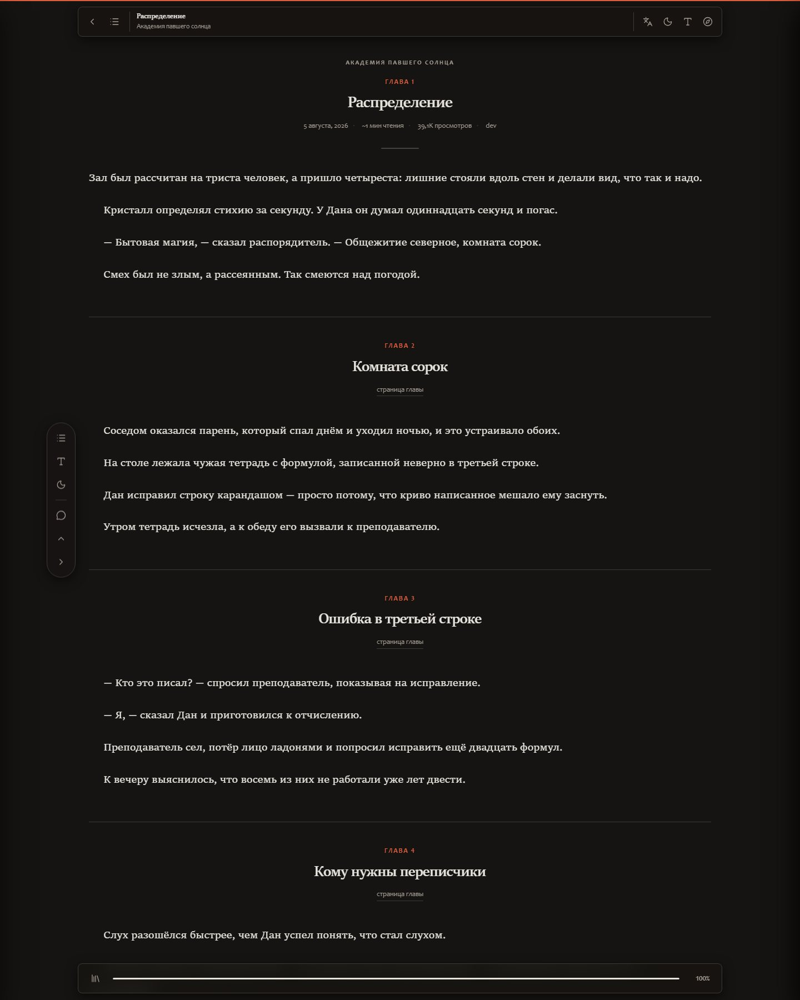

<div align="center">

<h1>XI&nbsp;Novels</h1>

<h3>Хватит вести блог. Запусти платформу новелл.</h3>

<p>
Бесплатная GPL-тема для WordPress без единой зависимости: она превращает<br>
чистую установку в полноценный сайт новелл, ранобэ и веб-новелл — каталог,<br>
главы, полноэкранная читалка, рейтинги, кабинет автора, библиотека и уголок читателя.<br>
<b>И нигде не видно, что это WordPress.</b>
</p>

[](https://xi.community)
[](#install)
[](docs/)
[](CHANGELOG.md)

<br>


[](LICENSE)
[](https://wordpress.org/)
[](https://www.php.net/)
[](https://getbootstrap.com/)


[](#languages)
[](#contributing)

[English](README.md) · **Русский** · [Português&nbsp;(BR)](README.pt-BR.md)

[📢 Telegram-канал](https://t.me/licht_re) · [💬 Чат сообщества](https://t.me/xicommunity)

</div>


> [!NOTE]
> **Бета 0.6.0 — платформа работает целиком.** Её можно поставить сегодня и публиковать тайтлы и главы. Не финален **слой представления**: Bootstrap 5 — текущая база, а не конечная точка.

> [!TIP]
> **Живое демо — [xi.community](https://xi.community).** Настоящий сайт на этой теме: полистайте каталог, откройте тайтл, попробуйте читалку и её настройки.


<details>
<summary><b>Что ещё меняется, а что уже стабильно</b></summary>

<br>

План в том, чтобы прогнать альтернативы Bootstrap и оставить ту, что выиграет по реальным цифрам.

**Что меряется, прежде чем фреймворк останется:** вес после gzip, блокирующие рендер байты, LCP на среднем телефоне, сдвиг layout на сетке каталога и ощущение от сорока минут чтения — ритм строк, контраст ночью, скорость применения настроек.

**На скамейке:** Bootstrap 5 (сейчас) · Tailwind собранным подмножеством без CDN · UnoCSS · Bulma · Pico.css · чистый CSS только на собственных токенах темы, вообще без фреймворка.

Разметка общих компонентов (навбар, оффканвас, модалки, формы, вкладки) между бетами будет меняться. **Модель данных, иерархия шаблонов и хуки уже стабильны** — то, что построено на них, переживёт замену. Замеры и решение появятся в [CHANGELOG.md](CHANGELOG.md); свои измерения приносите в issues.

**Про демо:** xi.community работает на сборке под WordPress до релиза собственной платформы команды на **Elixir**. Когда та выйдет, сайт переедет на неё, а эта тема останется здесь как реализация под WordPress — бесплатной, под GPL и на собственной ветке развития.

</details>

---

## Почему сайт новелл — это не блог

Сайт новелл — отдельный жанр сайта. У тайтла есть главы, у глав порядок, читатель возвращается за следующей, автор публикует несколько раз в неделю, и почти все читают ночью с телефона. WordPress из коробки даёт записи и рубрики — то есть ничего из перечисленного.

Остальные варианты: тема с маркетплейса за 5–9 тысяч рублей, приваренная к конструктору, или SaaS, которому принадлежат ваши читатели. Этот репозиторий — третий путь: вся платформа одной темой, которую можно прочитать, форкнуть, переименовать и запустить. Бесплатно и навсегда.

> **Никакого конструктора. Никакой «pro-версии». Ни подписки, ни npm, ни CDN, ни телеметрии.**

<table>
<tr>
<td width="33%" align="center">

📚<br><b>Каталог и рейтинг</b><br>
<sub>Обложки, жанры, фильтры, переживающие пагинацию, и отдельная страница рейтинга со взвешенной оценкой</sub>

</td>
<td width="33%" align="center">

📖<br><b>Полноэкранная читалка</b><br>
<sub>Ни шапки, ни подвала: четыре «бумаги», глоссарий, инструменты абзаца, чтение вслух голосом устройства</sub>

</td>
<td width="33%" align="center">

✍️<br><b>Кабинет автора</b><br>
<sub>Проекты, главы и редактор, написанный под прозу, — ни одного захода в <code>/wp-admin</code></sub>

</td>
</tr>
<tr>
<td align="center">

🛠️<br><b>Панель управления на сайте</b><br>
<sub><code>/manage/</code> — пользователи, роли, доступ PLUS, очередь на проверку, тайтлы и настройки</sub>

</td>
<td align="center">

📥<br><b>EPUB и FB2</b><br>
<sub>Любой тайтл скачивается книгой, и закрытые главы попадают в файл только тем, кому открыты</sub>

</td>
<td align="center">

🛰️<br><b>Уголок читателя</b><br>
<sub><code>/hub/</code> показывает площадку изнутри: кто говорит, о чём спорят, что читают прямо сейчас</sub>

</td>
</tr>
<tr>
<td align="center">

🎨<br><b>Студия темы</b><br>
<sub>Слева ручки, справа живой сайт: цвет, форма, шрифты и настройки чтения по умолчанию</sub>

</td>
<td align="center">

🌍<br><b>Три языка</b><br>
<sub>RU / EN / PT-BR насквозь — тема, студия и оба плагина комплекта</sub>

</td>
<td align="center">

🚫<br><b>Ноль зависимостей</b><br>
<sub>Без сборки, npm, CDN и трекеров — PHP, CSS и JS, которые читаются за вечер</sub>

</td>
</tr>
</table>

---

## Что появилось недавно

| | |
|:--|:--|
| **0.6.0** | **Скачивание книг закрывается ролью.** В панели управления выбирается, кому доступна выгрузка EPUB и FB2: всем, любому вошедшему, по доступу PLUS, «PLUS или выбранные роли» или только выбранным ролям — галочками по ролям площадки, включая заведённые плагинами. Кнопка и прямая ссылка спрашивают одну и ту же проверку |
| **0.5.0** | **Уголок читателя** на `/hub/` — страница, показывающая площадку изнутри: кто говорит, о чём спорят, что читают прямо сейчас. Шесть счётчиков площадки в шапке, обе метрики сразу в таблице лидеров, карточка профиля со шкалой до следующего уровня. Оформлен как терминал — сетка и развёртка на полотне, срезанные углы, моноширинные подписи, сегментные шкалы — и не собирает про людей ничего нового, кроме кольца последних прочтений на 40 записей |
| **0.4.0** | **Инструменты абзаца и озвучка голосами устройства.** Клик по абзацу: закладка одной из четырёх красок, ссылка на него, цитата в обсуждение, предложенная правка с живым сравнением или чтение вслух с этого места. **Отложенная глава говорит, когда выйдет**, а расписание проекта переехало в настройки проекта, к автору |
| **0.3.3** | **Рейтинг стал отдельной страницей** `/ranking/`: три доски, три окна времени, фильтр по жанру и взвешенная оценка — одна пятёрка не обгоняет четыре сотни честных. **Массовое управление тайтлами** приехало отдельным плагином |
| **0.3.0** | **Свой редактор глав** вместо TinyMCE, **словарь проекта**, который ведёт переводчик, и **XI Studio** — студия темы с живым превью сайта рядом с ручками |

Все версии целиком — в **[CHANGELOG.md](CHANGELOG.md)**.

---

## Что внутри

<details open>
<summary><b>📖 &nbsp; Читателю</b></summary>

| | |
|:--|:--|
| 📚 **Каталог** | Обложки, жанры, теги, статус выпуска, сортировка по просмотрам / оценке / свежести, фильтры переживают пагинацию |
| 📖 **Полноэкранная читалка** | Ни шапки сайта, ни подвала. Панель прячется при прокрутке, шторка оглавления, док прогресса, листание `←` / `→` |
| 🎨 **Настройки чтения** | Кегль, интерлиньяж, ширина колонки, шрифт с засечками или гротеск, четыре «бумаги» (как сайт / белая / сепия / ночь) — сохраняются в браузере и применяются ко всем главам |
| 🔤 **Глоссарий в читалке** | Переименуйте что угодно прямо во время чтения: выделите слово, впишите, как надо, — и так во всех главах. Любой регистр или точный, слово целиком или часть, для одного тайтла или для всей площадки. Хранится в браузере и выгружается файлом: машинный перевод правится один раз и передаётся дальше |
| 🗣️ **Инструменты абзаца и чтение вслух** | Клик по абзацу: закладка одной из четырёх красок, ссылка на этот абзац, цитата в обсуждение, предложенная правка с живым сравнением или чтение вслух с этого места — голосом, уже установленным на устройстве, со скоростью, тоном, громкостью и предпрослушиванием |
| 🔖 **Библиотека без регистрации** | Закладки, история и «продолжить чтение» живут в `localStorage` |
| 🕒 **Лента обновлений** | Все свежие главы площадки, сгруппированные по дням: сегодня / вчера / дата |
| 🏆 **Рейтинг** | Отдельная страница `/ranking/`: три доски — по оценке, по просмотрам и по числу глав, — три окна времени и фильтр по жанру. Первая тройка стоит на подиуме, остальные идут строками с полосой относительно лидера |
| 🛰️ **Уголок читателя** | `/hub/` показывает площадку изнутри: кто говорит, о чём спорят, что читают прямо сейчас, шесть счётчиков и таблица лидеров. Оформлен как терминал, и всё движение гаснет по `prefers-reduced-motion` |
| 🌙 **Светлая, тёмная, системная** | Светлая по умолчанию, тёмная и «как в системе» — одним переключателем в шапке, без белой вспышки при загрузке |
| 📥 **EPUB и FB2** | Любой тайтл скачивается книгой — с обложкой, оглавлением и главами. Закрытые главы попадают в файл только тем, кому они открыты. Кому вообще доступна выгрузка — всем, вошедшим, по доступу PLUS или выбранным ролям — решается в панели управления |
| 🏅 **Серии и достижения** | Дни подряд, прочитанные главы, десять спокойных достижений в профиле — без очков и таблиц лидеров |
| 🔑 **Вход на самом сайте** | Вход, регистрация и восстановление пароля на одной центрированной странице в дизайне темы — читатель не попадает на `/wp-login.php` |
| 🌍 **RU / EN / PT-BR** | Переключатель языка в шапке, выбор запоминается кукой |

</details>

<details>
<summary><b>✍️ &nbsp; Автору и переводчику</b></summary>

| | |
|:--|:--|
| ✍️ **Кабинет прямо на сайте** | Проекты и главы создаются без захода в `/wp-admin` |
| 🧰 **Редактор под главы** | Свой редактор вместо TinyMCE: вставка из Word приходит чистой, разрыв сцены — одна кнопка, «причесать» правит кавычки, тире и лишние пробелы, поиск с заменой идёт по всей главе, режим фокуса убирает со страницы всё лишнее |
| 🔤 **Словарь проекта** | Имена и термины проекта лежат одним списком и приходят каждому читателю сами — или вписываются в текст глав одним проходом, с предварительным подсчётом совпадений |
| 💾 **Черновик не теряется** | Текст главы автосохраняется в браузере во время набора, счётчик слов live |
| 🔢 **Нумерация глав** | Следующий номер подставляется сам; дробные номера (`12.5`) для экстр |
| 🗓️ **Расписание и очередь** | Дни недели и время выхода лежат в настройках проекта вместе со сводкой: сколько глав ждёт и когда выйдет ближайшая. Отложенная глава несёт значок «В очереди», дату выхода и сколько до неё осталось |
| 👑 **Ранний доступ** | Глава помечается как PLUS: гостю закрыта, в оглавлении с бейджем |
| 🧑‍🎤 **Публичные профили** | Страница автора со статистикой и вкладками: проекты / главы / статьи |

</details>

<details>
<summary><b>🛠️ &nbsp; Владельцу</b></summary>

| | |
|:--|:--|
| 🕵️ **WordPress не читается** | Верхняя панель убрана; generator, RSD, wlwmanifest, shortlink, oEmbed, emoji, X-Pingback и версии в путях вычищены; REST переехал с `/wp-json/` на `/api/`; страница входа в вашем стиле |
| 🛠️ **Панель управления на сайте** | `/manage/`: пользователи и роли, доступ PLUS со сроком, очередь на проверку, все тайтлы и настройки площадки, включая доступ к скачиванию книг, — без `/wp-admin` |
| 🎨 **Студия темы** | Плагин в комплекте: экран, где слева ручки, а справа живой сайт. Цвет, скругления, тени, ширина, шрифты и настройки читалки — всё видно до сохранения, пять готовых наборов, перенос файлом |
| 🎛️ **Кастомайзер** | Акцент и цвет премиума, схема по умолчанию, двенадцать блоков главной по отдельности, текст подвала, соцсети |
| 👥 **Соавторы** | В проекте может быть несколько переводчиков: каждый добавляет и правит его главы, команда видна на странице тайтла |
| 🛒 **Платные главы** | Мост к WooCommerce: к главе привязывается товар, и она открывается после покупки — рядом с PLUS |
| 💬 **Обсуждения (по желанию)** | По умолчанию выключены. Включённые — со своей разметкой, ответами на один уровень, спойлерами, отметками «полезно» и бейджами автора и команды |
| 👑 **Доступ PLUS** | Выдаётся читателю на 30 / 90 / 365 дней или бессрочно; главы с отметкой PLUS открываются ему автоматически |
| 🗂️ **Массовое управление тайтлами** | Плагин в комплекте: фильтры по владельцу, жанру, статусу, обложке и 18+, выделение с Shift — или всё найденное сразу, — а дальше публикация, жанры и метки, владелец и команда, одна обложка на пачку, PLUS на все главы тайтла, выгрузка в CSV и удаление. Каждый идентификатор ещё раз проверяется через `current_user_can()`, так что подменённая форма чужой тайтл не тронет |
| 🧩 **Свои виджеты** | «Подборка новелл» (просмотры / оценка / новинки / обновления) и «Последние главы» |
| 👥 **Аккаунты по вашим правилам** | Открытость регистрации и роль новых пользователей (автор / участник / читатель) настраиваются в кастомайзере; частые неудачные попытки притормаживаются, скрытое поле отсекает ботов |
| 🌐 **Готова к переводу** | 982 строки в теме и ещё 257 в трёх плагинах комплекта — русский исходник, собранные английский и бразильский португальский `.mo`, плюс скрипт сборки |

</details>

---

## Скриншоты

<sub>Всё ниже — сама тема с демо-контентом из этого репозитория. Ничего не нарисовано в редакторе.</sub>

<table>
<tr>
<td width="50%" valign="top">


**Каталог** — чипы жанров, фильтр статуса, пять порядков сортировки, шесть обложек в ряд.

</td>
<td width="50%" valign="top">


**Страница тайтла** — компактная шапка, дальше плоские секции: описание, оглавление с поиском и колонка с фактами, оценкой и похожим.

</td>
</tr>
<tr>
<td valign="top">


**Читалка** — ни шапки сайта, ни подвала, ни колонок. Панель прячется при чтении.

</td>
<td valign="top">


**Настройки чтения** — кегль, интерлиньяж, ширина колонки, шрифт, четыре «бумаги».

</td>
</tr>
<tr>
<td valign="top">



**Вход и регистрация** на самом сайте — одна центрированная страница: вход, регистрация, восстановление пароля.

</td>
<td valign="top">



**Панель управления** на `/manage/` — роли, доступ PLUS со сроком, очередь на проверку, тайтлы и настройки.

</td>
</tr>
<tr>
<td valign="top">


**Профиль автора** — обложка, статистика, подиум самых читаемых, вкладки.

</td>
<td valign="top">



**Библиотека** — закладки и история, хранятся в браузере.

</td>
</tr>
<tr>
<td valign="top">


**Обновления** — все свежие главы: сегодня / вчера / дата.

</td>
<td valign="top">


**Блог** — ведущая запись, рубрики, боковая колонка.

</td>
</tr>
<tr>
<td valign="top">



**Тёмная схема** — нейтральный графит, переключается из шапки.

</td>
<td valign="top">


**Мобильная** — нижняя навигация, одна колонка.

</td>
</tr>
</table>

---

<a name="install"></a>

## Установка за две минуты

```bash
git clone https://github.com/rurumiru/wordpress-novel-themes.git
cp -r wordpress-novel-themes/themes/xi-novels /путь/к/wordpress/wp-content/themes/
```

1. **Внешний вид → Темы → XI Novels → Активировать.** При активации тема сама создаёт страницы «Кабинет автора» и «Моя библиотека» и заводит статусы выпуска (Выходит / Завершён / Заморожен / Анонс).
2. **Настройки → Постоянные ссылки → «Название записи».**
3. **Новеллы → Добавить** — первый тайтл.
4. По желанию: включите плагины из `plugins/` — студию темы, массовый импорт, массовое управление тайтлами.

<details>
<summary><b>Посмотреть без базы данных</b></summary>

<br>

Нет MySQL? В репозитории лежит рецепт песочницы: встроенный сервер PHP плюс официальный SQLite-дропин, с демо-каталогом.

```bash
php -S localhost:8080 -t wordpress tools/dev-router.php
```

Пошагово: **[docs/install.ru.md](docs/install.ru.md)**.

</details>

---

## Документация

| | |
|:--|:--|
| **[Установка](docs/install.ru.md)** | Боевая установка, песочница на SQLite, ЧПУ, первый тайтл |
| **[Руководство автора](docs/authoring.ru.md)** | Кабинет, нумерация глав, ранний доступ |
| **[Импорт и тяжёлые загрузки](docs/import.ru.md)** | Импортёр из репозитория: манифесты JSON и CSV **и папки или ZIP-архивы с файлами глав `.txt` / `.html` / `.md`**, рецепты для WP All Import и WP-CLI и все лимиты PHP / nginx / LiteSpeed / Cloudflare, которые нужно поднять под крупные обложки |
| **[Кастомизация](docs/customizing.md)** | Токены дизайна, кастомайзер, дочерняя тема, хуки |
| **[Разработка](docs/development.md)** | Карта файлов, модель данных, иерархия шаблонов, переводы |
| **[Демо-контент](demo/README.md)** | Плагин, который наполняет сайт (12 тайтлов, 48 глав, блог, баннеры) кнопкой в **Инструменты → Демо-контент** и убирает всё обратно; для серверов с SSH есть скрипты |

---

## Сравнение

| | Этот репозиторий | Платные темы с маркетплейсов | SaaS-платформы новелл |
|:--|:--|:--|:--|
| Цена | **Бесплатно, GPL** | 5–9 тыс. ₽ плюс продления | Процент с дохода / подписка |
| Читаемый исходник | **Да, ~19 тыс. строк, комментированный API** | Обфусцированный JSON конструктора | Нет |
| Нужен конструктор | **Нет** | Обычно да | — |
| npm / composer / сборка | **Нет** | Часто | — |
| Внешние запросы в рантайме | **Ноль** | Шрифты с CDN, трекеры | Всё |
| Кабинет автора на фронте | **Да** | Редко | Да |
| Полноэкранная читалка с настройками | **Да** | Редко | Да |
| Читатели и данные ваши | **Да** | Да | **Нет** |
| Выглядит как WordPress | **Нет** | Да | — |

---

<a name="stack"></a>

## Стек

Намеренно скучный и без зависимостей — тему можно прочитать за вечер.

| Слой | Что используется | Почему |
|:--|:--|:--|
| CMS | **WordPress 6.4+** (проверено на 7.0), классическая тема, без FSE | Редактор сайта не собирает ни читалку, ни кабинет, ни рейтинг без десятка плагинов |
| PHP | **7.4+**, обычный процедурный API WordPress | Ни composer, ни автозагрузчика, ни фреймворка — кладётся на любой хостинг |
| CSS-фреймворк | **Bootstrap 5.3.3** локально в `assets/vendor/` | Сетка, навбар, оффканвас, модалки, выпадашки, вкладки, формы, пагинация — доступные и проверенные |
| Слой дизайна | **Свой CSS на HSL-токенах** (`style.css`, `skin.css`, `pages.css`, `parts.css`) | Bootstrap перекрашивается через переменные; светлая и тёмная лестницы построены по посчитанному контрасту |
| JS | **Ванильный ES5**, ~3,2 тыс. строк, плюс бандл Bootstrap | Без сборки, без npm, без фреймворка |
| Данные | Два типа записей (`novel`, `chapter`), три таксономии (`genre`, `novel_tag`, `novel_status`), мета | Стандартная модель WP — контент остаётся переносимым |
| Редактор | Свой редактор на `contenteditable`, ~600 строк | Главе нужны чистая вставка, разрывы сцен и фокус, а не конструктор страниц |
| Хранилище клиента | `localStorage`: библиотека, история, настройки чтения, глоссарий, черновики | Читателю не нужен аккаунт, чтобы не потерять место |
| REST | Три маршрута под `/api/xin/v1/` — `rate`, `like`, `skin` | Анонимная оценка, «полезно» в обсуждениях и живое превью студии — без плагинов |
| Локализация | Gettext `.po` / `.mo` плюс скрипт сборки | Плагин перевода не нужен |
| Иконки | Инлайн-SVG спрайт в PHP | Без иконочного шрифта и внешних запросов |
| Шрифты | Системный стек | Ничего не тянется из Google |
| Плагины в комплекте | **XI Studio**, **XI Novels Import**, **XI Novels Manager** — ~3,7 тыс. строк PHP | Каждый необязателен: тема работает и одна, плагины добавляют студию, массовый импорт и массовое управление |
| Песочница | Встроенный сервер PHP + **SQLite** | Превью без установки MySQL |

<details>
<summary><b>Структура репозитория</b></summary>

```
themes/xi-novels/      тема — всё описанное выше здесь
  inc/                 типы записей, метабоксы, шаблонные функции, кастомайзер,
                       виджеты, кабинет автора, локализация, walker'ы, чистка
  template-parts/      секции главной, каталог, экраны кабинета
  assets/              css (7 файлов), js (5 файлов), vendor/bootstrap
  languages/           en_US и pt_BR, .po + .mo
demo/                  демо: плагин с двумя кнопками и скрипты для консоли
plugins/               xi-studio (студия темы), xi-novel-import (массовый импорт),
                       xi-novel-manager (массовое управление тайтлами) и заметки
                       о сторонних плагинах: какие нужны и зачем
tools/                 роутер dev-сервера, импортёр, сборщик переводов,
                       i18n/ — по одной карте «русский → локаль» на язык
docs/                  установка, публикация, импорт, кастомизация, разработка
screenshots/           как это выглядит
```

</details>

---

<a name="languages"></a>

## Языки

Интерфейс идёт на **русском** (исходные строки), **английском** (`languages/en_US.mo`) и **бразильском португальском** (`languages/pt_BR.mo`) — по 982 строки, плюс ещё 257 в плагинах комплекта (студия 36, импорт 127, управление 94). Посетитель переключает язык кнопкой RU / EN / PT в шапке, выбор запоминается кукой; **Кастомайзер → Бренд → Основной язык** решает, каким сайт откроется новому гостю.


<sub>Тот же сайт — <code>?lang=en</code> или переключатель в шапке.</sub>

Четвёртый язык — это один файл: PHP-карта «исходная строка → перевод».

```bash
cp tools/i18n/en_US.php tools/i18n/de_DE.php
# перевести правую часть каждой строки, затем
php tools/build-translations.php
```

Скрипт заново собирает все переводимые строки темы, показывает, чего в карте не хватает и что больше не используется, и пишет `.po` и `.mo` для каждой карты в `tools/i18n/`. Добавьте локаль в `xin_languages()` (`inc/i18n.php`) — и она появится в переключателе. Строки самого WordPress и форматы дат берутся из языкового пакета сайта: поставьте его в **Настройки → Общие**, если админка тоже должна говорить на этом языке.

---

## Планы

Идеи, которые вписываются в правило «без зависимостей». Голосуйте 👍 в issues или присылайте PR.

**Дальше**

- [ ] **Сравнение фреймворков** — Bootstrap против подмножества Tailwind, UnoCSS, Bulma, Pico и варианта вообще без фреймворка: вес после gzip, LCP на среднем телефоне, сдвиг layout, комфорт чтения
- [ ] **Сборка без CSS-фреймворка** как вероятный финал: у темы уже есть своя система токенов, и фреймворк может оказаться лишним весом
- [ ] Проход по типографике читалки: выверенная длина строки, оптические поля, ритм строк под каждый язык
- [ ] Ещё локали: DE, ES, ID, VI

<details>
<summary><b>Сделано</b></summary>

<br>

- [x] **Уголок читателя** — страница, показывающая площадку изнутри: кто говорит, о чём спорят, что читают прямо сейчас. Оформлен как терминал: сетка и развёртка на полотне, срезанные углы, моноширинные подписи, сегментные шкалы. Ничего нового про людей не собирается, кроме кольца последних прочтений на 40 записей
- [x] **Рейтинг отдельной страницей** — три доски, три окна времени, фильтр по жанру и взвешенная оценка
- [x] **Массовое управление тайтлами** — фильтры, выделение с Shift, действия над сотнями тайтлов сразу и выгрузка в CSV
- [x] Экспорт тайтла в EPUB / FB2
- [x] Серии чтения и простые достижения
- [x] Команды переводчиков (несколько авторов на проект)
- [x] Платные главы через мост к WooCommerce
- [x] Массовый импорт глав — `.txt`, `.md`, `.html`, `.docx` и ZIP пачками, по десять файлов за проход, чтобы выдержал обычный хостинг. Документ Google выгружается в `.docx` и идёт тем же путём
- [x] Опциональный модуль обсуждений (по желанию, выключен по умолчанию)
- [x] Инструменты абзаца в читалке и озвучка голосами устройства
- [x] Очередь отложенных глав с обратным отсчётом до выхода
- [x] Три языка насквозь: русский, английский, бразильский португальский — тема, кабинет и оба плагина

</details>

---

## Частые вопросы

<details>
<summary><b>Заработает на обычном хостинге?</b></summary><br>
Да. Это классическая тема: PHP, CSS, JS. Ни composer, ни node, ни крона.
</details>

<details>
<summary><b>Нужны плагины?</b></summary><br>
Нет. Кеш и антиспам — по желанию, см. <a href="plugins/README.md">plugins/</a>. Три плагина из этого репозитория тоже необязательны: тема работает и без них.
</details>

<details>
<summary><b>Можно продавать сайт на этой теме?</b></summary><br>
Да. GPL: переименовывайте, ребрендите, берите деньги. Атрибуция не требуется.
</details>

<details>
<summary><b>Можно взять дизайн без WordPress?</b></summary><br>
CSS и JS дополнительно доступны под MIT — можно.
</details>

<details>
<summary><b>А блочный редактор?</b></summary><br>
Главы и тайтлы намеренно на классическом редакторе (автор пишет длинный текст). Страницы и записи блога работают с блоками как обычно.
</details>

<details>
<summary><b>Сколько глав выдержит?</b></summary><br>
Списки глав кешируются и сортируются по числовой мете; тысячи глав на тайтл — расчётный режим.
</details>

<details>
<summary><b>Есть демо?</b></summary><br>
Да — <a href="https://xi.community">xi.community</a> работает на этой теме. А ещё можно клонировать репозиторий и запустить песочницу: она сама наполнит демо-каталог, и все скриншоты выше сняты именно с неё.
</details>

---

## Пользуетесь? Упоминание — приятно

Лицензия не требует ничего сверх GPL: тему можно применять в коммерческих проектах, форкать, перекрашивать, строить на ней услуги. Но если ваш сайт работает на ней и вы об этом где-то скажете — в подвале, на странице «о проекте», в посте — проекту от этого правда легче.

В теме есть готовая строка: **Настроить → подвал → «Работает на XI Novels»**, по умолчанию выключена. Или своя ссылка:

```html
<a href="https://github.com/rurumiru/wordpress-novel-themes">Работает на теме XI Novels</a>
```

**Хотите поддержать?** Приходите в Telegram — [📢 канал](https://t.me/licht_re) и [💬 чат сообщества](https://t.me/xicommunity). Баг-репорты, скриншоты своих сайтов, идеи и просто спасибо — всё туда; все версии сначала обсуждаются там.

---

<a name="contributing"></a>

## Участие

Issues и pull request'ы приветствуются. Два правила: **никакой сборки** (тема должна оставаться правимой текстовым редактором) и **никаких внешних зависимостей в рантайме**.

Принятая работа подписывается по имени в [CHANGELOG.md](CHANGELOG.md) — так пришли инструменты абзаца в читалке и студия голосов, от [@HeavenlyCatCodes](https://github.com/HeavenlyCatCodes).

## Лицензия

**GPL-2.0-or-later** на тему целиком — единственная корректная лицензия для производной от WordPress.

Части, не производные от WordPress — CSS в `assets/css/` и JavaScript в `assets/js/` — дополнительно доступны под **MIT**, чтобы дизайн-систему можно было унести в проект без WordPress. Bootstrap 5.3.3 поставляется под своей лицензией MIT. Скриншоты иллюстративны и в лицензируемый код не входят.

---

<div align="center">

### Если это сэкономило вам сотню долларов и выходные — поставьте звезду. ⭐

[](https://xi.community)
[](https://t.me/xicommunity)

<sub>Ключевые слова: тема WordPress для новелл · ранобэ · веб-новеллы · сайт новелл · читалка глав · платформа для переводчиков · light novel wordpress theme · webnovel platform · free GPL novel theme</sub>

</div>
